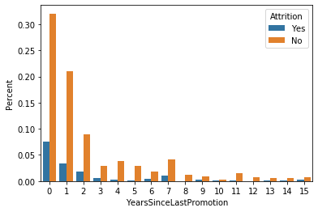

##IBM Turnover rate analysis

```python
## the dataset is about the employees data of IBM and the thing I would like to figure out is to analyse the turnover rate 
# of employees inside IBM and what are the main issues caused some employees leave their job.
# The goal is to create or improve different retention strategies on targeted employees. Overall, 
# the implementation of this model will allow management to create better decision-making actions. 
```


```python
# Attrtion can happen for many reasons: looking for other opportunities, a negative working environment, bad management,
# sickness of employees, or maybe excessive working hours
# now let's make the analysis and figure out what is the causal factors and use model to make things nerdy
```


```python
import pandas as pd
import numpy as np
import matplotlib.pyplot as plt
import seaborn as sns
%matplotlib inline
```


```python
data = pd.read_csv('C:/Users/liuyu/Documents/Kaggle datasets/IBM HR analytics/ibm-hr-analytics-employee-attrition-performance/WA_Fn-UseC_-HR-Employee-Attrition.csv')
```


```python
data.head()
```


<div>
<style scoped>
    .dataframe tbody tr th:only-of-type {
        vertical-align: middle;
    }

    .dataframe tbody tr th {
        vertical-align: top;
    }

    .dataframe thead th {
        text-align: right;
    }
</style>
<table border="1" class="dataframe">
  <thead>
    <tr style="text-align: right;">
      <th></th>
      <th>Age</th>
      <th>Attrition</th>
      <th>BusinessTravel</th>
      <th>DailyRate</th>
      <th>Department</th>
      <th>DistanceFromHome</th>
      <th>Education</th>
      <th>EducationField</th>
      <th>EmployeeCount</th>
      <th>EmployeeNumber</th>
      <th>...</th>
      <th>RelationshipSatisfaction</th>
      <th>StandardHours</th>
      <th>StockOptionLevel</th>
      <th>TotalWorkingYears</th>
      <th>TrainingTimesLastYear</th>
      <th>WorkLifeBalance</th>
      <th>YearsAtCompany</th>
      <th>YearsInCurrentRole</th>
      <th>YearsSinceLastPromotion</th>
      <th>YearsWithCurrManager</th>
    </tr>
  </thead>
  <tbody>
    <tr>
      <th>0</th>
      <td>41</td>
      <td>Yes</td>
      <td>Travel_Rarely</td>
      <td>1102</td>
      <td>Sales</td>
      <td>1</td>
      <td>2</td>
      <td>Life Sciences</td>
      <td>1</td>
      <td>1</td>
      <td>...</td>
      <td>1</td>
      <td>80</td>
      <td>0</td>
      <td>8</td>
      <td>0</td>
      <td>1</td>
      <td>6</td>
      <td>4</td>
      <td>0</td>
      <td>5</td>
    </tr>
    <tr>
      <th>1</th>
      <td>49</td>
      <td>No</td>
      <td>Travel_Frequently</td>
      <td>279</td>
      <td>Research &amp; Development</td>
      <td>8</td>
      <td>1</td>
      <td>Life Sciences</td>
      <td>1</td>
      <td>2</td>
      <td>...</td>
      <td>4</td>
      <td>80</td>
      <td>1</td>
      <td>10</td>
      <td>3</td>
      <td>3</td>
      <td>10</td>
      <td>7</td>
      <td>1</td>
      <td>7</td>
    </tr>
    <tr>
      <th>2</th>
      <td>37</td>
      <td>Yes</td>
      <td>Travel_Rarely</td>
      <td>1373</td>
      <td>Research &amp; Development</td>
      <td>2</td>
      <td>2</td>
      <td>Other</td>
      <td>1</td>
      <td>4</td>
      <td>...</td>
      <td>2</td>
      <td>80</td>
      <td>0</td>
      <td>7</td>
      <td>3</td>
      <td>3</td>
      <td>0</td>
      <td>0</td>
      <td>0</td>
      <td>0</td>
    </tr>
    <tr>
      <th>3</th>
      <td>33</td>
      <td>No</td>
      <td>Travel_Frequently</td>
      <td>1392</td>
      <td>Research &amp; Development</td>
      <td>3</td>
      <td>4</td>
      <td>Life Sciences</td>
      <td>1</td>
      <td>5</td>
      <td>...</td>
      <td>3</td>
      <td>80</td>
      <td>0</td>
      <td>8</td>
      <td>3</td>
      <td>3</td>
      <td>8</td>
      <td>7</td>
      <td>3</td>
      <td>0</td>
    </tr>
    <tr>
      <th>4</th>
      <td>27</td>
      <td>No</td>
      <td>Travel_Rarely</td>
      <td>591</td>
      <td>Research &amp; Development</td>
      <td>2</td>
      <td>1</td>
      <td>Medical</td>
      <td>1</td>
      <td>7</td>
      <td>...</td>
      <td>4</td>
      <td>80</td>
      <td>1</td>
      <td>6</td>
      <td>3</td>
      <td>3</td>
      <td>2</td>
      <td>2</td>
      <td>2</td>
      <td>2</td>
    </tr>
  </tbody>
</table>
<p>5 rows × 35 columns</p>
</div>


```python
# a super cleaned dataset w/o any null
data.isnull().any()
```


    Age                         False
    Attrition                   False
    BusinessTravel              False
    DailyRate                   False
    Department                  False
    DistanceFromHome            False
    Education                   False
    EducationField              False
    EmployeeCount               False
    EmployeeNumber              False
    EnvironmentSatisfaction     False
    Gender                      False
    HourlyRate                  False
    JobInvolvement              False
    JobLevel                    False
    JobRole                     False
    JobSatisfaction             False
    MaritalStatus               False
    MonthlyIncome               False
    MonthlyRate                 False
    NumCompaniesWorked          False
    Over18                      False
    OverTime                    False
    PercentSalaryHike           False
    PerformanceRating           False
    RelationshipSatisfaction    False
    StandardHours               False
    StockOptionLevel            False
    TotalWorkingYears           False
    TrainingTimesLastYear       False
    WorkLifeBalance             False
    YearsAtCompany              False
    YearsInCurrentRole          False
    YearsSinceLastPromotion     False
    YearsWithCurrManager        False
    dtype: bool


```python
df = data.copy()
```


```python
data.shape
```


    (1470, 35)


```python
df.dtypes
```


    Age                          int64
    Attrition                   object
    BusinessTravel              object
    DailyRate                    int64
    Department                  object
    DistanceFromHome             int64
    Education                    int64
    EducationField              object
    EmployeeCount                int64
    EmployeeNumber               int64
    EnvironmentSatisfaction      int64
    Gender                      object
    HourlyRate                   int64
    JobInvolvement               int64
    JobLevel                     int64
    JobRole                     object
    JobSatisfaction              int64
    MaritalStatus               object
    MonthlyIncome                int64
    MonthlyRate                  int64
    NumCompaniesWorked           int64
    Over18                      object
    OverTime                    object
    PercentSalaryHike            int64
    PerformanceRating            int64
    RelationshipSatisfaction     int64
    StandardHours                int64
    StockOptionLevel             int64
    TotalWorkingYears            int64
    TrainingTimesLastYear        int64
    WorkLifeBalance              int64
    YearsAtCompany               int64
    YearsInCurrentRole           int64
    YearsSinceLastPromotion      int64
    YearsWithCurrManager         int64
    dtype: object


```python
## there are 35 columns with 34 features and here I will not do any other feature engineering job, let just move forward
```

## Exploring the dataset


```python
# before we start the job of visualization, we need know what we want to do for the project and it makes the future jobs insightful
# What is the questions we want to answer? -- answer the question and give a summary, finally make our recommendation
```


```python
# could be a proper pipeline: Gender Analysis, Analysis by Genderation and Education, The impact of income, Working environment,
# other in-depth look into Attrition, Analysis and Models, Conclusion
```


```python

```


```python
attrition_rate = df.Attrition.value_counts()/len(df)
```


```python
# the data is kind of imbalaned and we need take this into consideration as we build the model later
attrition_rate
```


    No     0.838776
    Yes    0.161224
    Name: Attrition, dtype: float64


```python
df.describe()
```


<div>
<style scoped>
    .dataframe tbody tr th:only-of-type {
        vertical-align: middle;
    }

    .dataframe tbody tr th {
        vertical-align: top;
    }

    .dataframe thead th {
        text-align: right;
    }
</style>
<table border="1" class="dataframe">
  <thead>
    <tr style="text-align: right;">
      <th></th>
      <th>Age</th>
      <th>DailyRate</th>
      <th>DistanceFromHome</th>
      <th>Education</th>
      <th>EmployeeCount</th>
      <th>EmployeeNumber</th>
      <th>EnvironmentSatisfaction</th>
      <th>HourlyRate</th>
      <th>JobInvolvement</th>
      <th>JobLevel</th>
      <th>...</th>
      <th>RelationshipSatisfaction</th>
      <th>StandardHours</th>
      <th>StockOptionLevel</th>
      <th>TotalWorkingYears</th>
      <th>TrainingTimesLastYear</th>
      <th>WorkLifeBalance</th>
      <th>YearsAtCompany</th>
      <th>YearsInCurrentRole</th>
      <th>YearsSinceLastPromotion</th>
      <th>YearsWithCurrManager</th>
    </tr>
  </thead>
  <tbody>
    <tr>
      <th>count</th>
      <td>1470.000000</td>
      <td>1470.000000</td>
      <td>1470.000000</td>
      <td>1470.000000</td>
      <td>1470.0</td>
      <td>1470.000000</td>
      <td>1470.000000</td>
      <td>1470.000000</td>
      <td>1470.000000</td>
      <td>1470.000000</td>
      <td>...</td>
      <td>1470.000000</td>
      <td>1470.0</td>
      <td>1470.000000</td>
      <td>1470.000000</td>
      <td>1470.000000</td>
      <td>1470.000000</td>
      <td>1470.000000</td>
      <td>1470.000000</td>
      <td>1470.000000</td>
      <td>1470.000000</td>
    </tr>
    <tr>
      <th>mean</th>
      <td>36.923810</td>
      <td>802.485714</td>
      <td>9.192517</td>
      <td>2.912925</td>
      <td>1.0</td>
      <td>1024.865306</td>
      <td>2.721769</td>
      <td>65.891156</td>
      <td>2.729932</td>
      <td>2.063946</td>
      <td>...</td>
      <td>2.712245</td>
      <td>80.0</td>
      <td>0.793878</td>
      <td>11.279592</td>
      <td>2.799320</td>
      <td>2.761224</td>
      <td>7.008163</td>
      <td>4.229252</td>
      <td>2.187755</td>
      <td>4.123129</td>
    </tr>
    <tr>
      <th>std</th>
      <td>9.135373</td>
      <td>403.509100</td>
      <td>8.106864</td>
      <td>1.024165</td>
      <td>0.0</td>
      <td>602.024335</td>
      <td>1.093082</td>
      <td>20.329428</td>
      <td>0.711561</td>
      <td>1.106940</td>
      <td>...</td>
      <td>1.081209</td>
      <td>0.0</td>
      <td>0.852077</td>
      <td>7.780782</td>
      <td>1.289271</td>
      <td>0.706476</td>
      <td>6.126525</td>
      <td>3.623137</td>
      <td>3.222430</td>
      <td>3.568136</td>
    </tr>
    <tr>
      <th>min</th>
      <td>18.000000</td>
      <td>102.000000</td>
      <td>1.000000</td>
      <td>1.000000</td>
      <td>1.0</td>
      <td>1.000000</td>
      <td>1.000000</td>
      <td>30.000000</td>
      <td>1.000000</td>
      <td>1.000000</td>
      <td>...</td>
      <td>1.000000</td>
      <td>80.0</td>
      <td>0.000000</td>
      <td>0.000000</td>
      <td>0.000000</td>
      <td>1.000000</td>
      <td>0.000000</td>
      <td>0.000000</td>
      <td>0.000000</td>
      <td>0.000000</td>
    </tr>
    <tr>
      <th>25%</th>
      <td>30.000000</td>
      <td>465.000000</td>
      <td>2.000000</td>
      <td>2.000000</td>
      <td>1.0</td>
      <td>491.250000</td>
      <td>2.000000</td>
      <td>48.000000</td>
      <td>2.000000</td>
      <td>1.000000</td>
      <td>...</td>
      <td>2.000000</td>
      <td>80.0</td>
      <td>0.000000</td>
      <td>6.000000</td>
      <td>2.000000</td>
      <td>2.000000</td>
      <td>3.000000</td>
      <td>2.000000</td>
      <td>0.000000</td>
      <td>2.000000</td>
    </tr>
    <tr>
      <th>50%</th>
      <td>36.000000</td>
      <td>802.000000</td>
      <td>7.000000</td>
      <td>3.000000</td>
      <td>1.0</td>
      <td>1020.500000</td>
      <td>3.000000</td>
      <td>66.000000</td>
      <td>3.000000</td>
      <td>2.000000</td>
      <td>...</td>
      <td>3.000000</td>
      <td>80.0</td>
      <td>1.000000</td>
      <td>10.000000</td>
      <td>3.000000</td>
      <td>3.000000</td>
      <td>5.000000</td>
      <td>3.000000</td>
      <td>1.000000</td>
      <td>3.000000</td>
    </tr>
    <tr>
      <th>75%</th>
      <td>43.000000</td>
      <td>1157.000000</td>
      <td>14.000000</td>
      <td>4.000000</td>
      <td>1.0</td>
      <td>1555.750000</td>
      <td>4.000000</td>
      <td>83.750000</td>
      <td>3.000000</td>
      <td>3.000000</td>
      <td>...</td>
      <td>4.000000</td>
      <td>80.0</td>
      <td>1.000000</td>
      <td>15.000000</td>
      <td>3.000000</td>
      <td>3.000000</td>
      <td>9.000000</td>
      <td>7.000000</td>
      <td>3.000000</td>
      <td>7.000000</td>
    </tr>
    <tr>
      <th>max</th>
      <td>60.000000</td>
      <td>1499.000000</td>
      <td>29.000000</td>
      <td>5.000000</td>
      <td>1.0</td>
      <td>2068.000000</td>
      <td>4.000000</td>
      <td>100.000000</td>
      <td>4.000000</td>
      <td>5.000000</td>
      <td>...</td>
      <td>4.000000</td>
      <td>80.0</td>
      <td>3.000000</td>
      <td>40.000000</td>
      <td>6.000000</td>
      <td>4.000000</td>
      <td>40.000000</td>
      <td>18.000000</td>
      <td>15.000000</td>
      <td>17.000000</td>
    </tr>
  </tbody>
</table>
<p>8 rows × 26 columns</p>
</div>


```python
attrition_summary_1= df.iloc[:,0:20].groupby('Attrition')
```


```python
attrition_summary_1.mean()
```


<div>
<style scoped>
    .dataframe tbody tr th:only-of-type {
        vertical-align: middle;
    }

    .dataframe tbody tr th {
        vertical-align: top;
    }

    .dataframe thead th {
        text-align: right;
    }
</style>
<table border="1" class="dataframe">
  <thead>
    <tr style="text-align: right;">
      <th></th>
      <th>Age</th>
      <th>DailyRate</th>
      <th>DistanceFromHome</th>
      <th>Education</th>
      <th>EmployeeCount</th>
      <th>EmployeeNumber</th>
      <th>EnvironmentSatisfaction</th>
      <th>HourlyRate</th>
      <th>JobInvolvement</th>
      <th>JobLevel</th>
      <th>JobSatisfaction</th>
      <th>MonthlyIncome</th>
      <th>MonthlyRate</th>
    </tr>
    <tr>
      <th>Attrition</th>
      <th></th>
      <th></th>
      <th></th>
      <th></th>
      <th></th>
      <th></th>
      <th></th>
      <th></th>
      <th></th>
      <th></th>
      <th></th>
      <th></th>
      <th></th>
    </tr>
  </thead>
  <tbody>
    <tr>
      <th>No</th>
      <td>37.561233</td>
      <td>812.504461</td>
      <td>8.915653</td>
      <td>2.927007</td>
      <td>1.0</td>
      <td>1027.656123</td>
      <td>2.771290</td>
      <td>65.952149</td>
      <td>2.770479</td>
      <td>2.145985</td>
      <td>2.778589</td>
      <td>6832.739659</td>
      <td>14265.779400</td>
    </tr>
    <tr>
      <th>Yes</th>
      <td>33.607595</td>
      <td>750.362869</td>
      <td>10.632911</td>
      <td>2.839662</td>
      <td>1.0</td>
      <td>1010.345992</td>
      <td>2.464135</td>
      <td>65.573840</td>
      <td>2.518987</td>
      <td>1.637131</td>
      <td>2.468354</td>
      <td>4787.092827</td>
      <td>14559.308017</td>
    </tr>
  </tbody>
</table>
</div>


```python
attrition_summary_1.median()
```


<div>
<style scoped>
    .dataframe tbody tr th:only-of-type {
        vertical-align: middle;
    }

    .dataframe tbody tr th {
        vertical-align: top;
    }

    .dataframe thead th {
        text-align: right;
    }
</style>
<table border="1" class="dataframe">
  <thead>
    <tr style="text-align: right;">
      <th></th>
      <th>Age</th>
      <th>DailyRate</th>
      <th>DistanceFromHome</th>
      <th>Education</th>
      <th>EmployeeCount</th>
      <th>EmployeeNumber</th>
      <th>EnvironmentSatisfaction</th>
      <th>HourlyRate</th>
      <th>JobInvolvement</th>
      <th>JobLevel</th>
      <th>JobSatisfaction</th>
      <th>MonthlyIncome</th>
      <th>MonthlyRate</th>
    </tr>
    <tr>
      <th>Attrition</th>
      <th></th>
      <th></th>
      <th></th>
      <th></th>
      <th></th>
      <th></th>
      <th></th>
      <th></th>
      <th></th>
      <th></th>
      <th></th>
      <th></th>
      <th></th>
    </tr>
  </thead>
  <tbody>
    <tr>
      <th>No</th>
      <td>36</td>
      <td>817</td>
      <td>7</td>
      <td>3</td>
      <td>1</td>
      <td>1022</td>
      <td>3</td>
      <td>66</td>
      <td>3</td>
      <td>2</td>
      <td>3</td>
      <td>5204</td>
      <td>14120</td>
    </tr>
    <tr>
      <th>Yes</th>
      <td>32</td>
      <td>699</td>
      <td>9</td>
      <td>3</td>
      <td>1</td>
      <td>1017</td>
      <td>3</td>
      <td>66</td>
      <td>3</td>
      <td>1</td>
      <td>3</td>
      <td>3202</td>
      <td>14618</td>
    </tr>
  </tbody>
</table>
</div>


```python
attrition_summary_2 = df.iloc[:,20:]
```


```python
attrition_summary_2['Attrition'] = df.Attrition
```


```python
attrition_summary_2 = attrition_summary_2.groupby('Attrition')
```


```python
attrition_summary_2.mean()
```


<div>
<style scoped>
    .dataframe tbody tr th:only-of-type {
        vertical-align: middle;
    }

    .dataframe tbody tr th {
        vertical-align: top;
    }

    .dataframe thead th {
        text-align: right;
    }
</style>
<table border="1" class="dataframe">
  <thead>
    <tr style="text-align: right;">
      <th></th>
      <th>NumCompaniesWorked</th>
      <th>PercentSalaryHike</th>
      <th>PerformanceRating</th>
      <th>RelationshipSatisfaction</th>
      <th>StandardHours</th>
      <th>StockOptionLevel</th>
      <th>TotalWorkingYears</th>
      <th>TrainingTimesLastYear</th>
      <th>WorkLifeBalance</th>
      <th>YearsAtCompany</th>
      <th>YearsInCurrentRole</th>
      <th>YearsSinceLastPromotion</th>
      <th>YearsWithCurrManager</th>
    </tr>
    <tr>
      <th>Attrition</th>
      <th></th>
      <th></th>
      <th></th>
      <th></th>
      <th></th>
      <th></th>
      <th></th>
      <th></th>
      <th></th>
      <th></th>
      <th></th>
      <th></th>
      <th></th>
    </tr>
  </thead>
  <tbody>
    <tr>
      <th>No</th>
      <td>2.645580</td>
      <td>15.231144</td>
      <td>3.153285</td>
      <td>2.733982</td>
      <td>80.0</td>
      <td>0.845093</td>
      <td>11.862936</td>
      <td>2.832928</td>
      <td>2.781022</td>
      <td>7.369019</td>
      <td>4.484185</td>
      <td>2.234388</td>
      <td>4.367397</td>
    </tr>
    <tr>
      <th>Yes</th>
      <td>2.940928</td>
      <td>15.097046</td>
      <td>3.156118</td>
      <td>2.599156</td>
      <td>80.0</td>
      <td>0.527426</td>
      <td>8.244726</td>
      <td>2.624473</td>
      <td>2.658228</td>
      <td>5.130802</td>
      <td>2.902954</td>
      <td>1.945148</td>
      <td>2.852321</td>
    </tr>
  </tbody>
</table>
</div>


##### by looking at the mean and median, some possible variables could be important
##### DistanceFromHome, JobLevel, working years, years since last promotion, stock option level, income, number of companies worked


```python
#TotalWokringYears is highly correlated with Age, Job level, and Monthlyincome, that makes sense
#there are some variables highly correlated, but nothing is really suprised us 
```


```python
corr = df.corr()
```


```python
sns.heatmap(corr,
           xticklabels = corr.columns.values,
           yticklabels = corr.columns.values,
           cmap="YlGnBu")
```


    <matplotlib.axes._subplots.AxesSubplot at 0x169d83ec978>


```python
## Gender Analysis
```


```python
## Questions to ask Ourselves
## What is the age distribution between males and females? Are there any significant discrepancies?. 
## What is the average job satisfaction by attrition status? Is any type of gender more disatisfied than the other? 
## What is the average salary by gender? What are the number of employees by Gender in each department?
```


```python
df.columns
```


    Index(['Age', 'Attrition', 'BusinessTravel', 'DailyRate', 'Department',
           'DistanceFromHome', 'Education', 'EducationField', 'EmployeeCount',
           'EmployeeNumber', 'EnvironmentSatisfaction', 'Gender', 'HourlyRate',
           'JobInvolvement', 'JobLevel', 'JobRole', 'JobSatisfaction',
           'MaritalStatus', 'MonthlyIncome', 'MonthlyRate', 'NumCompaniesWorked',
           'Over18', 'OverTime', 'PercentSalaryHike', 'PerformanceRating',
           'RelationshipSatisfaction', 'StandardHours', 'StockOptionLevel',
           'TotalWorkingYears', 'TrainingTimesLastYear', 'WorkLifeBalance',
           'YearsAtCompany', 'YearsInCurrentRole', 'YearsSinceLastPromotion',
           'YearsWithCurrManager'],
          dtype='object')


```python
gender_df = df.groupby(['Gender'])['Age'].mean()
gender_df
```


    Gender
    Female    37.329932
    Male      36.653061
    Name: Age, dtype: float64


```python
## Age distribution by gender
plt.figure(figsize=(10,5))
plt.subplot(2,1,1)
sns.distplot(df['Age'],color='grey')
plt.subplot(2,2,3)
sns.distplot(df['Age'][df['Gender'] == 'Male'],axlabel='Male',label='Male age')
plt.subplot(2,2,4)
sns.distplot(df['Age'][df['Gender'] == 'Female'],norm_hist=True,color = 'red', axlabel='Female')
plt.tight_layout(h_pad=2,w_pad=2)
```

    C:\Users\liuyu\Anaconda3\lib\site-packages\scipy\stats\stats.py:1713: FutureWarning: Using a non-tuple sequence for multidimensional indexing is deprecated; use `arr[tuple(seq)]` instead of `arr[seq]`. In the future this will be interpreted as an array index, `arr[np.array(seq)]`, which will result either in an error or a different result.
      return np.add.reduce(sorted[indexer] * weights, axis=axis) / sumval
    


```python
# distribution of job satisfaction
plt.figure(figsize = (8,5))
plt.subplot(2,1,1)
sns.barplot(x= 'JobSatisfaction',y='JobSatisfaction',data=df, estimator= lambda x:len(x)/len(df),color='lightblue')
plt.ylabel('Percent')
plt.title('Distribution of Job Satisfaction')
plt.subplot(2,2,3)
sns.boxplot(x= df.Attrition, y= df['JobSatisfaction'][df['Gender'] == 'Female'],order=['No', 'Yes'])
plt.title('Female')
plt.subplot(2,2,4)
sns.boxplot(x= df.Attrition, y= df['JobSatisfaction'][df['Gender'] == 'Male'],order=['No','Yes'])
plt.title('Male')
plt.tight_layout(h_pad=2, w_pad= 2)
plt.show()
```

    C:\Users\liuyu\Anaconda3\lib\site-packages\scipy\stats\stats.py:1713: FutureWarning: Using a non-tuple sequence for multidimensional indexing is deprecated; use `arr[tuple(seq)]` instead of `arr[seq]`. In the future this will be interpreted as an array index, `arr[np.array(seq)]`, which will result either in an error or a different result.
      return np.add.reduce(sorted[indexer] * weights, axis=axis) / sumval
    


```python
## Monthly income by Gender
plt.figure(figsize=(10,6))
sns.boxplot(df.Gender, df['MonthlyIncome'])
plt.title('income by gender')
```


    Text(0.5, 1.0, 'income by gender')


```python
from matplotlib.pyplot import pie, axis, show
```


```python
## Average income and presence by Department
plt.figure(figsize=(12,6))
plt.subplot(2,2,1)
sns.barplot(x=df.Gender, y=df.MonthlyIncome)
plt.text(x= 0, y= 4000, s='6686',va='center', ha='center')
plt.text(x= 1, y= 3500, s='6380',va='center', ha='center')
plt.title('Average Salary by Gender')
plt.subplot(2,2,2)
sns.countplot(x='Department',hue='Gender',data=df)
plt.ylabel('Number of Employees')
plt.title('Number of Employees by Department')
plt.show()

```

    C:\Users\liuyu\Anaconda3\lib\site-packages\scipy\stats\stats.py:1713: FutureWarning: Using a non-tuple sequence for multidimensional indexing is deprecated; use `arr[tuple(seq)]` instead of `arr[seq]`. In the future this will be interpreted as an array index, `arr[np.array(seq)]`, which will result either in an error or a different result.
      return np.add.reduce(sorted[indexer] * weights, axis=axis) / sumval
    


```python
## Attrition by Education Level
plt.figure(figsize=(15,5))
ax =plt.subplot(1,2,1)
#sns.countplot(y='Education', data = df[df['Attrition']=='No'])
sns.countplot(y='Education', data=df[df['Attrition']=='No'],order=[3,4,2,1,5])
plt.title('No')
plt.subplot(1,2,2,sharex=ax)
sns.countplot(y='Education', data=df[df['Attrition']=='Yes'],order=[3,4,2,1,5])
plt.title('Yes')
plt.suptitle('Attrition by Education Level')
```


    Text(0.5, 0.98, 'Attrition by Education Level')


#####

#### Impact of income towards Attrition


```python
#Questions to Ask Ourselves 

#What is the average monthly income by department? 
#Are there any significant differences between individuals who quit and didn't quit? 
#Are there significant changes in the level of income by Job Satisfaction? 
#Are individuals with a lower satisfaction getting much less income than the ones who are more satisfied? 
#Do employees who quit the organization have a much lower income than people who didn't quit the organization? 
#Do employees with a higher performance rating earn more than with a lower performance rating? Is the difference significant by Attrition status?
```


```python
#Average income by Department
plt.figure(figsize=(10,3))
plt.subplot(1,2,1)
sns.barplot(x='Department',y='MonthlyIncome',data=df[df['Attrition']=='No'],color='tomato',label='No')
plt.legend(loc='best')
plt.xticks(rotation=90)
plt.subplot(1,2,2, sharey=plt.subplot(1,2,1))
sns.barplot(x='Department',y='MonthlyIncome',data=df[df['Attrition']=='Yes'],color='lightgreen',label='Yes')
plt.legend(loc='best')
plt.suptitle('Average Income by Department and Attrition Status')
plt.xticks(rotation=90)

```

    C:\Users\liuyu\Anaconda3\lib\site-packages\scipy\stats\stats.py:1713: FutureWarning: Using a non-tuple sequence for multidimensional indexing is deprecated; use `arr[tuple(seq)]` instead of `arr[seq]`. In the future this will be interpreted as an array index, `arr[np.array(seq)]`, which will result either in an error or a different result.
      return np.add.reduce(sorted[indexer] * weights, axis=axis) / sumval
    C:\Users\liuyu\Anaconda3\lib\site-packages\ipykernel_launcher.py:7: MatplotlibDeprecationWarning: Adding an axes using the same arguments as a previous axes currently reuses the earlier instance.  In a future version, a new instance will always be created and returned.  Meanwhile, this warning can be suppressed, and the future behavior ensured, by passing a unique label to each axes instance.
      import sys
    


    (array([0, 1, 2]), <a list of 3 Text xticklabel objects>)


```python
#temp1 = df[df['Attrition']=='No'].groupby(['JobSatisfaction'])['MonthlyIncome'].median()
#temp2 = df[df['Attrition']=='Yes'].groupby(['JobSatisfaction'])['MonthlyIncome'].median()
temp = df.groupby(['JobSatisfaction','Attrition'])['MonthlyIncome'].median()
```


```python
temp = temp.unstack()
```


```python
## is income a reason for employee to leave?
temp.plot(kind='bar',figsize=(10,5))
plt.title('Median Income by Attrition status')
```


    Text(0.5, 1.0, 'Median Income by Attrition status')


```python
# Income and level of attrition
sns.scatterplot(y=df.MonthlyIncome, x=df.PercentSalaryHike, hue=df.Attrition)
plt.legend(loc='upper right')
```


    <matplotlib.legend.Legend at 0x169dac244a8>


```python
## Is Overtime a important factor here?
temp1 = df.groupby(['Attrition','OverTime']).count()
```


```python
temp1['n'] = temp1['Age']
temp1.n.unstack()
```


<div>
<style scoped>
    .dataframe tbody tr th:only-of-type {
        vertical-align: middle;
    }

    .dataframe tbody tr th {
        vertical-align: top;
    }

    .dataframe thead th {
        text-align: right;
    }
</style>
<table border="1" class="dataframe">
  <thead>
    <tr style="text-align: right;">
      <th>OverTime</th>
      <th>No</th>
      <th>Yes</th>
    </tr>
    <tr>
      <th>Attrition</th>
      <th></th>
      <th></th>
    </tr>
  </thead>
  <tbody>
    <tr>
      <th>No</th>
      <td>944</td>
      <td>289</td>
    </tr>
    <tr>
      <th>Yes</th>
      <td>110</td>
      <td>127</td>
    </tr>
  </tbody>
</table>
</div>


```python
## We can calculate the percentage if necessary
```


```python
## Average and Percent Difference of Daily Rates
temp_daily_rate = df.groupby(['Attrition', 'JobRole'])
```


```python
temp_daily_rate = temp_daily_rate['JobRole', 'Attrition', 'DailyRate'].mean().unstack()
```


```python
temp_daily_rate
```


<div>
<style scoped>
    .dataframe tbody tr th:only-of-type {
        vertical-align: middle;
    }

    .dataframe tbody tr th {
        vertical-align: top;
    }

    .dataframe thead tr th {
        text-align: left;
    }

    .dataframe thead tr:last-of-type th {
        text-align: right;
    }
</style>
<table border="1" class="dataframe">
  <thead>
    <tr>
      <th></th>
      <th colspan="9" halign="left">DailyRate</th>
    </tr>
    <tr>
      <th>JobRole</th>
      <th>Healthcare Representative</th>
      <th>Human Resources</th>
      <th>Laboratory Technician</th>
      <th>Manager</th>
      <th>Manufacturing Director</th>
      <th>Research Director</th>
      <th>Research Scientist</th>
      <th>Sales Executive</th>
      <th>Sales Representative</th>
    </tr>
    <tr>
      <th>Attrition</th>
      <th></th>
      <th></th>
      <th></th>
      <th></th>
      <th></th>
      <th></th>
      <th></th>
      <th></th>
      <th></th>
    </tr>
  </thead>
  <tbody>
    <tr>
      <th>No</th>
      <td>869.811475</td>
      <td>760.325000</td>
      <td>794.720812</td>
      <td>778.123711</td>
      <td>802.518519</td>
      <td>801.923077</td>
      <td>817.555102</td>
      <td>813.910781</td>
      <td>862.340000</td>
    </tr>
    <tr>
      <th>Yes</th>
      <td>643.333333</td>
      <td>749.916667</td>
      <td>802.645161</td>
      <td>876.600000</td>
      <td>708.300000</td>
      <td>823.000000</td>
      <td>710.723404</td>
      <td>746.350877</td>
      <td>734.090909</td>
    </tr>
  </tbody>
</table>
</div>


```python

```


```python

```


```python
f, ax = plt.subplots(figsize=(15,5))
sns.countplot(y='Department',data=df, hue = 'Attrition',orient ='v')
```


    <matplotlib.axes._subplots.AxesSubplot at 0x169da8cb978>


```python
ax = sns.barplot(x = 'YearsSinceLastPromotion',
                y = 'YearsSinceLastPromotion',
                hue = 'Attrition',
                data = df,
                estimator = lambda x: len(x) / len(df))
ax.set(ylabel = 'Percent')
```

    C:\Users\liuyu\Anaconda3\lib\site-packages\scipy\stats\stats.py:1713: FutureWarning: Using a non-tuple sequence for multidimensional indexing is deprecated; use `arr[tuple(seq)]` instead of `arr[seq]`. In the future this will be interpreted as an array index, `arr[np.array(seq)]`, which will result either in an error or a different result.
      return np.add.reduce(sorted[indexer] * weights, axis=axis) / sumval
    


    [Text(0, 0.5, 'Percent')]





```python
ax1 = sns.countplot(x = 'YearsSinceLastPromotion',
                   data = df,
                   hue = 'Attrition')
```


```python
ax2 = sns.barplot(x = 'Education',
                y = 'Education',
                hue = 'Attrition',
                data = df,
                estimator = lambda x: len(x) / len(df))
ax2.set(ylabel = 'Percent')
```

    C:\Users\liuyu\Anaconda3\lib\site-packages\scipy\stats\stats.py:1713: FutureWarning: Using a non-tuple sequence for multidimensional indexing is deprecated; use `arr[tuple(seq)]` instead of `arr[seq]`. In the future this will be interpreted as an array index, `arr[np.array(seq)]`, which will result either in an error or a different result.
      return np.add.reduce(sorted[indexer] * weights, axis=axis) / sumval
    


    [Text(0, 0.5, 'Percent')]


```python
ax4 = sns.countplot(x = 'Gender',
                   data = df,
                   hue = 'Attrition')
```


```python
col_categorical = df[['Gender','Education','Department']]
```


```python
col_categorical.head()
```


<div>
<style scoped>
    .dataframe tbody tr th:only-of-type {
        vertical-align: middle;
    }

    .dataframe tbody tr th {
        vertical-align: top;
    }

    .dataframe thead th {
        text-align: right;
    }
</style>
<table border="1" class="dataframe">
  <thead>
    <tr style="text-align: right;">
      <th></th>
      <th>Gender</th>
      <th>Education</th>
      <th>Department</th>
    </tr>
  </thead>
  <tbody>
    <tr>
      <th>0</th>
      <td>Female</td>
      <td>2</td>
      <td>Sales</td>
    </tr>
    <tr>
      <th>1</th>
      <td>Male</td>
      <td>1</td>
      <td>Research &amp; Development</td>
    </tr>
    <tr>
      <th>2</th>
      <td>Male</td>
      <td>2</td>
      <td>Research &amp; Development</td>
    </tr>
    <tr>
      <th>3</th>
      <td>Female</td>
      <td>4</td>
      <td>Research &amp; Development</td>
    </tr>
    <tr>
      <th>4</th>
      <td>Male</td>
      <td>1</td>
      <td>Research &amp; Development</td>
    </tr>
  </tbody>
</table>
</div>


```python

```


```python
#fig, ax = plt.subplots(nrows = 1, ncols = 3,figsize = (20,5))
for i in list(range(len(col_categorical.columns))):
    fig, ax = plt.subplots(figsize = (3,2))
    sns.countplot(x = col_categorical.columns[i],
                   data = df,
                   hue = 'Attrition')
    ax.set_title('Attrition ('+ col_categorical.columns[i]+ ')')
```


```python

```


```python
df.Department.value_counts()
```


    Research & Development    961
    Sales                     446
    Human Resources            63
    Name: Department, dtype: int64


```python
sns.countplot(x = 'Gender',
                   data = df,
                   hue = 'Attrition')
```


    <matplotlib.axes._subplots.AxesSubplot at 0x169daf32f98>


```python

```

### Modeling

##### Logistic Regression


```python
#Read the analytics csv file and store our dataset into a dataframe called "df"
from sklearn import preprocessing
from sklearn.linear_model import LogisticRegression
from sklearn.preprocessing import LabelEncoder
from sklearn.model_selection import train_test_split
from sklearn.metrics import accuracy_score, classification_report, precision_score, recall_score, confusion_matrix, precision_recall_curve
from sklearn.preprocessing import RobustScaler
```


```python
### Feature Importance
## since we have more than 30 variables and we may need to deduct some not very important ones
## we will use decision tree classifier
```


```python
le = preprocessing.LabelEncoder()
```


```python
df.dtypes
```


    Age                          int64
    Attrition                   object
    BusinessTravel              object
    DailyRate                    int64
    Department                  object
    DistanceFromHome             int64
    Education                    int64
    EducationField              object
    EmployeeCount                int64
    EmployeeNumber               int64
    EnvironmentSatisfaction      int64
    Gender                      object
    HourlyRate                   int64
    JobInvolvement               int64
    JobLevel                     int64
    JobRole                     object
    JobSatisfaction              int64
    MaritalStatus               object
    MonthlyIncome                int64
    MonthlyRate                  int64
    NumCompaniesWorked           int64
    Over18                      object
    OverTime                    object
    PercentSalaryHike            int64
    PerformanceRating            int64
    RelationshipSatisfaction     int64
    StandardHours                int64
    StockOptionLevel             int64
    TotalWorkingYears            int64
    TrainingTimesLastYear        int64
    WorkLifeBalance              int64
    YearsAtCompany               int64
    YearsInCurrentRole           int64
    YearsSinceLastPromotion      int64
    YearsWithCurrManager         int64
    dtype: object


```python
le.fit(df.BusinessTravel)
```


    LabelEncoder()


```python
le.classes_
```


    array(['Non-Travel', 'Travel_Frequently', 'Travel_Rarely'], dtype=object)


```python
df['BusinessTravel'] = le.transform(df.BusinessTravel)
```


```python
for i in ['Department','EducationField','Gender','JobRole','MaritalStatus','Over18','OverTime']:
    le.fit(df[i])
    df[i] = le.transform(df[i])
```


```python
df.dtypes
```


    Age                          int64
    Attrition                   object
    BusinessTravel               int32
    DailyRate                    int64
    Department                   int32
    DistanceFromHome             int64
    Education                    int64
    EducationField               int32
    EmployeeCount                int64
    EmployeeNumber               int64
    EnvironmentSatisfaction      int64
    Gender                       int32
    HourlyRate                   int64
    JobInvolvement               int64
    JobLevel                     int64
    JobRole                      int32
    JobSatisfaction              int64
    MaritalStatus                int32
    MonthlyIncome                int64
    MonthlyRate                  int64
    NumCompaniesWorked           int64
    Over18                       int32
    OverTime                     int32
    PercentSalaryHike            int64
    PerformanceRating            int64
    RelationshipSatisfaction     int64
    StandardHours                int64
    StockOptionLevel             int64
    TotalWorkingYears            int64
    TrainingTimesLastYear        int64
    WorkLifeBalance              int64
    YearsAtCompany               int64
    YearsInCurrentRole           int64
    YearsSinceLastPromotion      int64
    YearsWithCurrManager         int64
    dtype: object


```python
from sklearn import tree
from sklearn.tree import DecisionTreeClassifier
from sklearn.model_selection import train_test_split
```


```python
plt.style.use('fivethirtyeight')
plt.rcParams['figure.figsize'] = (12,6)
```


```python
# Create train and test splits
target_name = 'Attrition'
X = df.drop('Attrition', axis=1)
```


```python
y=df[target_name]
```


```python
X_train, X_test, y_train, y_test = train_test_split(X,y,test_size=0.15, random_state=123, stratify=y)
```


```python
from sklearn.feature_selection import SelectKBest
from sklearn.feature_selection import chi2
```


```python
bestfeatures = SelectKBest(score_func=chi2, k=10)
fit = bestfeatures.fit(X,y)
dfscores = pd.DataFrame(fit.scores_)
dfcolumns = pd.DataFrame(X.columns)
#concat two dataframes for better visualization 
featureScores = pd.concat([dfcolumns,dfscores],axis=1)
featureScores.columns = ['Specs','Score']  #naming the dataframe columns
print(featureScores.nlargest(10,'Score'))  #print 10 best features
```

                       Specs          Score
    17         MonthlyIncome  127922.293694
    18           MonthlyRate    1196.633553
    2              DailyRate     956.580494
    27     TotalWorkingYears     230.721618
    30        YearsAtCompany     142.100054
    31    YearsInCurrentRole     117.522596
    33  YearsWithCurrManager     110.671534
    0                    Age      84.155277
    21              OverTime      63.845067
    4       DistanceFromHome      63.772142
    


```python
dtree = tree.DecisionTreeClassifier(
    #max_depth=3,
    class_weight="balanced",
    min_weight_fraction_leaf=0.01
    )
dtree = dtree.fit(X_train,y_train)

```


```python
## plot the importances ##
importances = dtree.feature_importances_
feat_names = df.drop(['Attrition'],axis=1).columns

```


```python
indices = np.argsort(importances)[::-1]
plt.figure(figsize=(12,6))
plt.title("Feature importances by DecisionTreeClassifier")
plt.bar(range(len(indices)), importances[indices], color='lightblue',  align="center")
plt.step(range(len(indices)), np.cumsum(importances[indices]), where='mid', label='Cumulative')
plt.xticks(range(len(indices)), feat_names[indices], rotation='vertical',fontsize=14)
plt.xlim([-1, len(indices)])
plt.show()
```


```python
## Then we will select top 5 feature for logistic regression, but keep in mind that the features we selected may not 
# as important as we expected. Must think about it with business sense
```


```python
front= df['Attrition']
df.drop(labels=['Attrition'], axis=1, inplace= True)
df.insert(0,'Attrition', front)
```


```python
df.head()
```


<div>
<style scoped>
    .dataframe tbody tr th:only-of-type {
        vertical-align: middle;
    }

    .dataframe tbody tr th {
        vertical-align: top;
    }

    .dataframe thead th {
        text-align: right;
    }
</style>
<table border="1" class="dataframe">
  <thead>
    <tr style="text-align: right;">
      <th></th>
      <th>Attrition</th>
      <th>Age</th>
      <th>BusinessTravel</th>
      <th>DailyRate</th>
      <th>Department</th>
      <th>DistanceFromHome</th>
      <th>Education</th>
      <th>EducationField</th>
      <th>EmployeeCount</th>
      <th>EmployeeNumber</th>
      <th>...</th>
      <th>RelationshipSatisfaction</th>
      <th>StandardHours</th>
      <th>StockOptionLevel</th>
      <th>TotalWorkingYears</th>
      <th>TrainingTimesLastYear</th>
      <th>WorkLifeBalance</th>
      <th>YearsAtCompany</th>
      <th>YearsInCurrentRole</th>
      <th>YearsSinceLastPromotion</th>
      <th>YearsWithCurrManager</th>
    </tr>
  </thead>
  <tbody>
    <tr>
      <th>0</th>
      <td>Yes</td>
      <td>41</td>
      <td>2</td>
      <td>1102</td>
      <td>2</td>
      <td>1</td>
      <td>2</td>
      <td>1</td>
      <td>1</td>
      <td>1</td>
      <td>...</td>
      <td>1</td>
      <td>80</td>
      <td>0</td>
      <td>8</td>
      <td>0</td>
      <td>1</td>
      <td>6</td>
      <td>4</td>
      <td>0</td>
      <td>5</td>
    </tr>
    <tr>
      <th>1</th>
      <td>No</td>
      <td>49</td>
      <td>1</td>
      <td>279</td>
      <td>1</td>
      <td>8</td>
      <td>1</td>
      <td>1</td>
      <td>1</td>
      <td>2</td>
      <td>...</td>
      <td>4</td>
      <td>80</td>
      <td>1</td>
      <td>10</td>
      <td>3</td>
      <td>3</td>
      <td>10</td>
      <td>7</td>
      <td>1</td>
      <td>7</td>
    </tr>
    <tr>
      <th>2</th>
      <td>Yes</td>
      <td>37</td>
      <td>2</td>
      <td>1373</td>
      <td>1</td>
      <td>2</td>
      <td>2</td>
      <td>4</td>
      <td>1</td>
      <td>4</td>
      <td>...</td>
      <td>2</td>
      <td>80</td>
      <td>0</td>
      <td>7</td>
      <td>3</td>
      <td>3</td>
      <td>0</td>
      <td>0</td>
      <td>0</td>
      <td>0</td>
    </tr>
    <tr>
      <th>3</th>
      <td>No</td>
      <td>33</td>
      <td>1</td>
      <td>1392</td>
      <td>1</td>
      <td>3</td>
      <td>4</td>
      <td>1</td>
      <td>1</td>
      <td>5</td>
      <td>...</td>
      <td>3</td>
      <td>80</td>
      <td>0</td>
      <td>8</td>
      <td>3</td>
      <td>3</td>
      <td>8</td>
      <td>7</td>
      <td>3</td>
      <td>0</td>
    </tr>
    <tr>
      <th>4</th>
      <td>No</td>
      <td>27</td>
      <td>2</td>
      <td>591</td>
      <td>1</td>
      <td>2</td>
      <td>1</td>
      <td>3</td>
      <td>1</td>
      <td>7</td>
      <td>...</td>
      <td>4</td>
      <td>80</td>
      <td>1</td>
      <td>6</td>
      <td>3</td>
      <td>3</td>
      <td>2</td>
      <td>2</td>
      <td>2</td>
      <td>2</td>
    </tr>
  </tbody>
</table>
<p>5 rows × 35 columns</p>
</div>


```python
df['int'] = 1
indep_var = ['Age', 'StockOptionLevel', 'OverTime', 'MonthlyIncome','YearsAtCompany','int', 'Attrition']
df = df[indep_var]
```


```python
le.fit(df['Attrition'])
df['Attrition'] = le.transform(df['Attrition'])
```


```python
df.head()
```


<div>
<style scoped>
    .dataframe tbody tr th:only-of-type {
        vertical-align: middle;
    }

    .dataframe tbody tr th {
        vertical-align: top;
    }

    .dataframe thead th {
        text-align: right;
    }
</style>
<table border="1" class="dataframe">
  <thead>
    <tr style="text-align: right;">
      <th></th>
      <th>Age</th>
      <th>StockOptionLevel</th>
      <th>OverTime</th>
      <th>MonthlyIncome</th>
      <th>YearsAtCompany</th>
      <th>int</th>
      <th>Attrition</th>
    </tr>
  </thead>
  <tbody>
    <tr>
      <th>0</th>
      <td>41</td>
      <td>0</td>
      <td>1</td>
      <td>5993</td>
      <td>6</td>
      <td>1</td>
      <td>1</td>
    </tr>
    <tr>
      <th>1</th>
      <td>49</td>
      <td>1</td>
      <td>0</td>
      <td>5130</td>
      <td>10</td>
      <td>1</td>
      <td>0</td>
    </tr>
    <tr>
      <th>2</th>
      <td>37</td>
      <td>0</td>
      <td>1</td>
      <td>2090</td>
      <td>0</td>
      <td>1</td>
      <td>1</td>
    </tr>
    <tr>
      <th>3</th>
      <td>33</td>
      <td>0</td>
      <td>1</td>
      <td>2909</td>
      <td>8</td>
      <td>1</td>
      <td>0</td>
    </tr>
    <tr>
      <th>4</th>
      <td>27</td>
      <td>1</td>
      <td>0</td>
      <td>3468</td>
      <td>2</td>
      <td>1</td>
      <td>0</td>
    </tr>
  </tbody>
</table>
</div>


```python
target_name = 'Attrition'
X = df.drop('Attrition', axis=1)

y=df[target_name]
X_train, X_test, y_train, y_test = train_test_split(X,y,test_size=0.15, random_state=123, stratify=y)

X_train.head()
```


<div>
<style scoped>
    .dataframe tbody tr th:only-of-type {
        vertical-align: middle;
    }

    .dataframe tbody tr th {
        vertical-align: top;
    }

    .dataframe thead th {
        text-align: right;
    }
</style>
<table border="1" class="dataframe">
  <thead>
    <tr style="text-align: right;">
      <th></th>
      <th>Age</th>
      <th>StockOptionLevel</th>
      <th>OverTime</th>
      <th>MonthlyIncome</th>
      <th>YearsAtCompany</th>
      <th>int</th>
    </tr>
  </thead>
  <tbody>
    <tr>
      <th>639</th>
      <td>49</td>
      <td>1</td>
      <td>0</td>
      <td>3580</td>
      <td>4</td>
      <td>1</td>
    </tr>
    <tr>
      <th>1019</th>
      <td>36</td>
      <td>2</td>
      <td>0</td>
      <td>5647</td>
      <td>3</td>
      <td>1</td>
    </tr>
    <tr>
      <th>1389</th>
      <td>31</td>
      <td>0</td>
      <td>0</td>
      <td>5003</td>
      <td>10</td>
      <td>1</td>
    </tr>
    <tr>
      <th>1392</th>
      <td>35</td>
      <td>0</td>
      <td>1</td>
      <td>5204</td>
      <td>10</td>
      <td>1</td>
    </tr>
    <tr>
      <th>1347</th>
      <td>36</td>
      <td>0</td>
      <td>0</td>
      <td>3886</td>
      <td>10</td>
      <td>1</td>
    </tr>
  </tbody>
</table>
</div>


```python

```


```python
import statsmodels.api as sm
iv = ['Age', 'StockOptionLevel', 'OverTime', 'MonthlyIncome','YearsAtCompany','int']
logReg = sm.Logit(y_train, X_train[iv])
answer = logReg.fit()

answer.summary
answer.params
```

    Optimization terminated successfully.
             Current function value: 0.381660
             Iterations 7
    


    Age                -0.030986
    StockOptionLevel   -0.530509
    OverTime            1.340164
    MonthlyIncome      -0.000072
    YearsAtCompany     -0.051855
    int                 0.033707
    dtype: float64


##### We could have a Employee Turnover Score = Age*(-0.03) + StockOptionLevel*(-0.530509) + OverTime*(1.340164) + YearsAtCompany*(-0.051855) + 0.0337


```python
# Create function to compute coefficients
coef = answer.params
def y (coef, Age, StockOptionLevel, OverTime, MonthlyIncome,YearsAtCompany) : 
    return coef[5] + coef[0]*Age + coef[1]*StockOptionLevel + coef[2]*OverTime + coef[3]*MonthlyIncome + coef[4]*YearsAtCompany

import numpy as np

# An Employee with 30 years old, have no stock, with Overtime, has monthlyincome of 4500, worked 5 years
y1 = y(coef,30,0,1,4500,5)
p = np.exp(y1) / (1+np.exp(y1))
p
```


    0.46482822014065883


```python
## we can have our retention plan for IBM
## now look at the accuracy of out model
```


```python
mydf = pd.read_csv('C:/Users/liuyu/Documents/Kaggle datasets/IBM HR analytics/ibm-hr-analytics-employee-attrition-performance/WA_Fn-UseC_-HR-Employee-Attrition.csv')
```


```python
for i in ['BusinessTravel','Department','EducationField','Gender','JobRole','MaritalStatus','Over18','OverTime','Attrition']:
    le.fit(mydf[i])
    mydf[i] = le.transform(mydf[i])
```


```python
# Create base rate model
def base_rate_model(X) :
    y = np.zeros(X.shape[0])
    return y
```


```python
# Create train and test splits
target_name = 'Attrition'
X = mydf.drop('Attrition', axis=1)
#robust_scaler = RobustScaler()
#X = robust_scaler.fit_transform(X)
y=mydf[target_name]
X_train, X_test, y_train, y_test = train_test_split(X,y,test_size=0.15, random_state=123, stratify=y)
```


```python
# Compare the Logistic Regression Model V.S. Base Rate Model V.S. Random Forest Model
from sklearn.metrics import roc_auc_score
from sklearn.metrics import classification_report
from sklearn.ensemble import RandomForestClassifier

from sklearn import tree
from sklearn.tree import DecisionTreeClassifier
from sklearn.linear_model import LogisticRegression
from sklearn.ensemble import ExtraTreesClassifier
from sklearn.ensemble import BaggingClassifier
from sklearn.ensemble import AdaBoostClassifier
from sklearn.ensemble import GradientBoostingClassifier
from sklearn.ensemble import VotingClassifier

```


```python
# Check accuracy of base rate model
y_base_rate = base_rate_model(X_test)
from sklearn.metrics import accuracy_score
print ("Base rate accuracy is %2.2f" % accuracy_score(y_test, y_base_rate))
print ("Base rate recall is %2.2f" % recall_score(y_test, y_base_rate))
print ("Base rate auc is %2.2f" % roc_auc_score(y_test, y_base_rate))
```

    Base rate accuracy is 0.84
    Base rate recall is 0.00
    Base rate auc is 0.50
    


```python
# Create train and test splits
target_name = 'Attrition'
X = df.drop('Attrition', axis=1)
#robust_scaler = RobustScaler()
#X = robust_scaler.fit_transform(X)
y=df[target_name]
X_train, X_test, y_train, y_test = train_test_split(X,y,test_size=0.15, random_state=123, stratify=y)
```


```python
# Using 10 fold Cross-Validation to train our Logistic Regression Model
from sklearn import model_selection
from sklearn.linear_model import LogisticRegression
kfold = model_selection.KFold(n_splits=10, random_state=7)
modelCV = LogisticRegression(class_weight = "balanced")
scoring = 'roc_auc'
results = model_selection.cross_val_score(modelCV, X_train, y_train, cv=kfold, scoring=scoring)
print("AUC: %.3f (%.3f)" % (results.mean(), results.std()))
```

    AUC: 0.743 (0.082)
    

    C:\Users\liuyu\Anaconda3\lib\site-packages\sklearn\linear_model\logistic.py:432: FutureWarning: Default solver will be changed to 'lbfgs' in 0.22. Specify a solver to silence this warning.
      FutureWarning)
    C:\Users\liuyu\Anaconda3\lib\site-packages\sklearn\linear_model\logistic.py:432: FutureWarning: Default solver will be changed to 'lbfgs' in 0.22. Specify a solver to silence this warning.
      FutureWarning)
    C:\Users\liuyu\Anaconda3\lib\site-packages\sklearn\linear_model\logistic.py:432: FutureWarning: Default solver will be changed to 'lbfgs' in 0.22. Specify a solver to silence this warning.
      FutureWarning)
    C:\Users\liuyu\Anaconda3\lib\site-packages\sklearn\linear_model\logistic.py:432: FutureWarning: Default solver will be changed to 'lbfgs' in 0.22. Specify a solver to silence this warning.
      FutureWarning)
    C:\Users\liuyu\Anaconda3\lib\site-packages\sklearn\linear_model\logistic.py:432: FutureWarning: Default solver will be changed to 'lbfgs' in 0.22. Specify a solver to silence this warning.
      FutureWarning)
    C:\Users\liuyu\Anaconda3\lib\site-packages\sklearn\linear_model\logistic.py:432: FutureWarning: Default solver will be changed to 'lbfgs' in 0.22. Specify a solver to silence this warning.
      FutureWarning)
    C:\Users\liuyu\Anaconda3\lib\site-packages\sklearn\linear_model\logistic.py:432: FutureWarning: Default solver will be changed to 'lbfgs' in 0.22. Specify a solver to silence this warning.
      FutureWarning)
    C:\Users\liuyu\Anaconda3\lib\site-packages\sklearn\linear_model\logistic.py:432: FutureWarning: Default solver will be changed to 'lbfgs' in 0.22. Specify a solver to silence this warning.
      FutureWarning)
    C:\Users\liuyu\Anaconda3\lib\site-packages\sklearn\linear_model\logistic.py:432: FutureWarning: Default solver will be changed to 'lbfgs' in 0.22. Specify a solver to silence this warning.
      FutureWarning)
    C:\Users\liuyu\Anaconda3\lib\site-packages\sklearn\linear_model\logistic.py:432: FutureWarning: Default solver will be changed to 'lbfgs' in 0.22. Specify a solver to silence this warning.
      FutureWarning)
    

#### ------------------------------------------------------------------------------------------------------------------------------------------------------------------------

#### Other models


```python
print ("---Base Model---")
base_roc_auc = roc_auc_score(y_test, base_rate_model(X_test))
print ("Base Rate AUC = %2.2f" % base_roc_auc)
print(classification_report(y_test, base_rate_model(X_test)))

# NOTE: By adding in "class_weight = balanced", the Logistic Auc increased by about 10%! This adjusts the threshold value
logis = LogisticRegression(class_weight = "balanced")
logis.fit(X_train, y_train)
print ("\n\n ---Logistic Model---")
logit_roc_auc = roc_auc_score(y_test, logis.predict(X_test))
print ("Logistic AUC = %2.2f" % logit_roc_auc)
print(classification_report(y_test, logis.predict(X_test)))

# Decision Tree Model
dtree = tree.DecisionTreeClassifier(
    #max_depth=3,
    class_weight="balanced",
    min_weight_fraction_leaf=0.01
    )
dtree = dtree.fit(X_train,y_train)
print ("\n\n ---Decision Tree Model---")
dt_roc_auc = roc_auc_score(y_test, dtree.predict(X_test))
print ("Decision Tree AUC = %2.2f" % dt_roc_auc)
print(classification_report(y_test, dtree.predict(X_test)))

# Random Forest Model
rf = RandomForestClassifier(
    n_estimators=1000, 
    max_depth=None, 
    min_samples_split=10, 
    class_weight="balanced"
    #min_weight_fraction_leaf=0.02 
    )
rf.fit(X_train, y_train)
print ("\n\n ---Random Forest Model---")
rf_roc_auc = roc_auc_score(y_test, rf.predict(X_test))
print ("Random Forest AUC = %2.2f" % rf_roc_auc)
print(classification_report(y_test, rf.predict(X_test)))


# Ada Boost
ada = AdaBoostClassifier(n_estimators=400, learning_rate=0.1)
ada.fit(X_train,y_train)
print ("\n\n ---AdaBoost Model---")
ada_roc_auc = roc_auc_score(y_test, ada.predict(X_test))
print ("AdaBoost AUC = %2.2f" % ada_roc_auc)
print(classification_report(y_test, ada.predict(X_test)))
```

    ---Base Model---
    Base Rate AUC = 0.50
                  precision    recall  f1-score   support
    
               0       0.84      1.00      0.91       185
               1       0.00      0.00      0.00        36
    
        accuracy                           0.84       221
       macro avg       0.42      0.50      0.46       221
    weighted avg       0.70      0.84      0.76       221
    
    
    
     ---Logistic Model---
    Logistic AUC = 0.71
                  precision    recall  f1-score   support
    
               0       0.92      0.73      0.82       185
               1       0.33      0.69      0.45        36
    
        accuracy                           0.72       221
       macro avg       0.63      0.71      0.63       221
    weighted avg       0.83      0.72      0.76       221
    
    
    
     ---Decision Tree Model---
    Decision Tree AUC = 0.62
                  precision    recall  f1-score   support
    
               0       0.88      0.74      0.80       185
               1       0.27      0.50      0.35        36
    
        accuracy                           0.70       221
       macro avg       0.58      0.62      0.58       221
    weighted avg       0.78      0.70      0.73       221
    
    

    C:\Users\liuyu\Anaconda3\lib\site-packages\sklearn\metrics\classification.py:1437: UndefinedMetricWarning: Precision and F-score are ill-defined and being set to 0.0 in labels with no predicted samples.
      'precision', 'predicted', average, warn_for)
    C:\Users\liuyu\Anaconda3\lib\site-packages\sklearn\metrics\classification.py:1437: UndefinedMetricWarning: Precision and F-score are ill-defined and being set to 0.0 in labels with no predicted samples.
      'precision', 'predicted', average, warn_for)
    C:\Users\liuyu\Anaconda3\lib\site-packages\sklearn\metrics\classification.py:1437: UndefinedMetricWarning: Precision and F-score are ill-defined and being set to 0.0 in labels with no predicted samples.
      'precision', 'predicted', average, warn_for)
    C:\Users\liuyu\Anaconda3\lib\site-packages\sklearn\linear_model\logistic.py:432: FutureWarning: Default solver will be changed to 'lbfgs' in 0.22. Specify a solver to silence this warning.
      FutureWarning)
    

    
    
     ---Random Forest Model---
    Random Forest AUC = 0.70
                  precision    recall  f1-score   support
    
               0       0.90      0.90      0.90       185
               1       0.50      0.50      0.50        36
    
        accuracy                           0.84       221
       macro avg       0.70      0.70      0.70       221
    weighted avg       0.84      0.84      0.84       221
    
    
    
     ---AdaBoost Model---
    AdaBoost AUC = 0.61
                  precision    recall  f1-score   support
    
               0       0.87      0.99      0.93       185
               1       0.89      0.22      0.36        36
    
        accuracy                           0.87       221
       macro avg       0.88      0.61      0.64       221
    weighted avg       0.87      0.87      0.83       221
    
    


```python
# Check accuracy of Logistic Model
from sklearn.linear_model import LogisticRegression
model = LogisticRegression(penalty='l2', C=1)
model.fit(X_train, y_train)
print ("Logistic accuracy is %2.2f" % accuracy_score(y_test, model.predict(X_test)))
print ("Logistic recall is %2.2f" % recall_score(y_test, model.predict(X_test)))
print ("Logistic auc is %2.2f" % roc_auc_score(y_test, logis.predict(X_test)))
```

    Logistic accuracy is 0.85
    Logistic recall is 0.11
    Logistic auc is 0.71
    

    C:\Users\liuyu\Anaconda3\lib\site-packages\sklearn\linear_model\logistic.py:432: FutureWarning: Default solver will be changed to 'lbfgs' in 0.22. Specify a solver to silence this warning.
      FutureWarning)
    


```python
# Create ROC Graph
from sklearn.metrics import roc_curve
fpr, tpr, thresholds = roc_curve(y_test, logis.predict_proba(X_test)[:,1])
rf_fpr, rf_tpr, rf_thresholds = roc_curve(y_test, rf.predict_proba(X_test)[:,1])
dt_fpr, dt_tpr, dt_thresholds = roc_curve(y_test, dtree.predict_proba(X_test)[:,1])
ada_fpr, ada_tpr, ada_thresholds = roc_curve(y_test, ada.predict_proba(X_test)[:,1])

plt.figure()

# Plot Logistic Regression ROC
plt.plot(fpr, tpr, label='Logistic Regression (area = %0.2f)' % logit_roc_auc)

# Plot Random Forest ROC
plt.plot(rf_fpr, rf_tpr, label='Random Forest (area = %0.2f)' % rf_roc_auc)

# Plot Decision Tree ROC
plt.plot(dt_fpr, dt_tpr, label='Decision Tree (area = %0.2f)' % dt_roc_auc)

# Plot AdaBoost ROC
plt.plot(ada_fpr, ada_tpr, label='AdaBoost (area = %0.2f)' % ada_roc_auc)

# Plot Base Rate ROC
plt.plot([0,1], [0,1],label='Base Rate' 'k--')

plt.xlim([0.0, 1.0])
plt.ylim([0.0, 1.05])
plt.xlabel('False Positive Rate')
plt.ylabel('True Positive Rate')
plt.title('ROC Graph')
plt.legend(loc="lower right")
plt.show()
```


```python
roc_auc_score(y_test, logis.predict_proba(X_test)[:,1])
```


    0.7714714714714714


```python
roc_auc_score(y_test, rf.predict_proba(X_test)[:,1])
```


    0.701951951951952


```python
roc_auc_score(y_test, dtree.predict_proba(X_test)[:,1])
```


    0.7063813813813815


```python
roc_auc_score(y_test, ada.predict_proba(X_test)[:,1])
```


    0.7539039039039039


```python
### 绘制决策树
```


```python
import os
os.environ["PATH"] += os.pathsep + 'C:/Program Files (x86)/Graphviz2.38/bin/'
```


```python
df.dtypes
```


    Age                 int64
    StockOptionLevel    int64
    OverTime            int32
    MonthlyIncome       int64
    YearsAtCompany      int64
    int                 int64
    Attrition           int32
    dtype: object


```python
feature_names = ['Age','StockOptionLevel','OverTime','MonthlyIncome','YearAtCompany','int']
target_names = ['Attrition']
```


```python
import sklearn.tree as tree
clf=tree.DecisionTreeRegressor(min_samples_split=50,max_leaf_nodes=15)

clf_fit=clf.fit(X_train,y_train)

tree.export_graphviz(clf_fit,out_file="tree.dot"  )

import pydotplus 
from IPython.display import Image

dot_data = tree.export_graphviz(clf_fit, out_file=None, 
feature_names=feature_names, 
class_names=target_names, 
filled=True, rounded=True, 
special_characters=True) 
graph = pydotplus.graph_from_dot_data(dot_data) 
Image(graph.create_png())
```


```python

```
